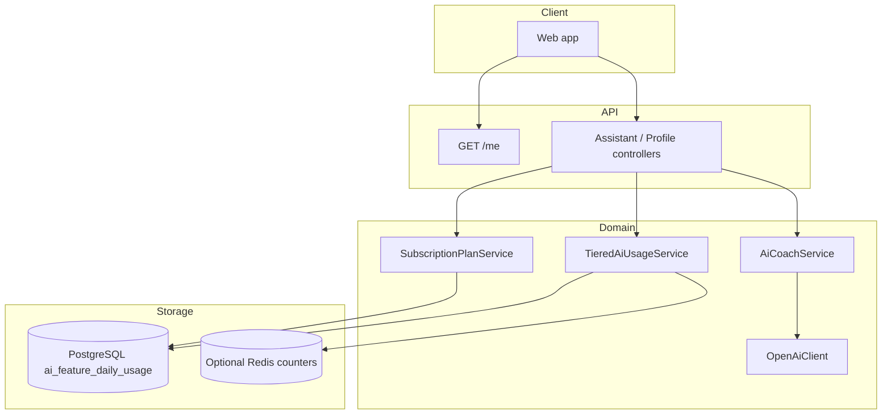

# YouMe tiered AI architecture

This document describes how **subscription plans** (Free / Plus / Gold) drive **AI depth**, **per-feature quotas**, and **upgrade prompts**. Implementation lives in the Spring Boot service; optional **Redis** accelerates usage counters when enabled.

## Plan resolution

- Column `profiles.subscription_plan`: `FREE`, `PLUS`, or `GOLD`.
- Legacy `profiles.is_premium = true` with plan `FREE` is treated as **PLUS** at read time (`SubscriptionPlanService`).
- Demo billing: `POST /me/upgrade` with body `{ "plan": "PLUS" | "GOLD" }` sets the tier and syncs `is_premium`.

## Metered features (`AiFeature`)

| Feature            | Purpose                                      |
|--------------------|----------------------------------------------|
| `CHAT_REPLY`       | `/matches/{id}/assistant/reply-ideas`        |
| `PROFILE_AI`       | `/me/assistant/profile-tips`                 |
| `MATCH_GREETING`   | LLM path of seeded assistant greeting        |
| `MATCH_INSIGHT`    | `/matches/{id}/assistant/match-insight`      |

Daily limits are configured under `app.ai.*-tier` in `application.yml`. Value **-1** means “unlimited” with a **fair-use cap** (`app.ai.gold-fair-use-daily-cap`, default 500).

## Usage counters

- **Primary store:** table `ai_feature_daily_usage` (user, date, feature, count).
- **Optional Redis:** set `app.ai.redis-usage-enabled: true` and `app.ai.redis.host` / `port`. Keys: `youme:ai:{userId}:{FEATURE}:{yyyy-MM-dd}` with TTL to end of usage day (`app.ai.usage-timezone`).

## AI orchestration

- `AiCoachService` prepends a **plan-aware system preamble** and scales **temperature**, **max tokens**, and **instructions** per `SubscriptionPlan`.
- `OpenAiClient` supports variable temperature for tier tuning.
- Match insights: **FREE** returns a **minimal template** without consuming `MATCH_INSIGHT` quota; **PLUS/GOLD** use LLM when configured and bill the feature when `source: llm`.

## API surfacing

- `GET /me` includes `subscriptionPlan`, `aiEntitlements` (per-feature quota snapshot), and `aiQuota` aligned to **chat replies** for backward compatibility.
- `GET /ai/plans` — public matrix of limits (for paywalls).
- `GET /ai/capabilities` — adds `redisUsageEnabled`.
- HTTP **429** on quota: `aiQuota`, `feature`, `currentPlan`, `suggestedUpgrade`, `upgradeHint`.

## Diagram

## Not yet in scope (extension points)

- **Feed deck caps** (e.g. 10/50 swipes per day) — add a separate counter or reuse plan service.
- **Safety / moderation** models — hook before `MessageController` persist; tier prompts in `AiCoachService` style.
- **Stripe / App Store** — replace `POST /me/upgrade` with webhook-driven `subscription_plan` updates.
