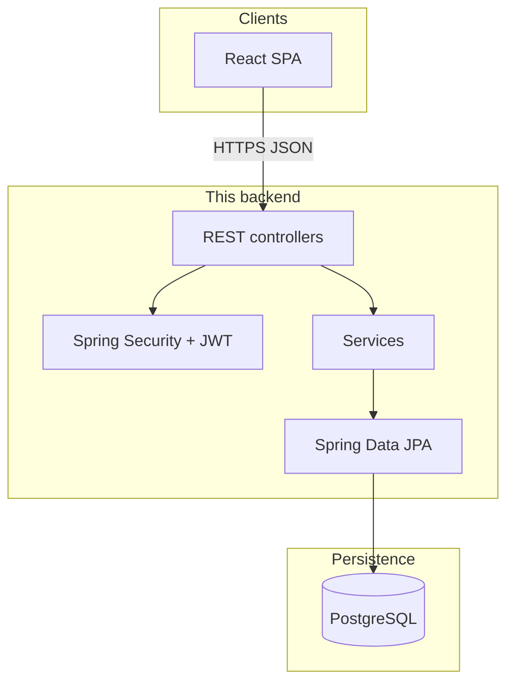

# YouMe — Backend Project Specification

**Audience:** Developers, architects, and **customers** who need to know what the API layer provides and which technologies implement it.

**Companion:** [README.md](./README.md) for run instructions. The SPA is documented under **`../frontend/`**.

---

## 1. What the backend delivers

| Capability | Description |
|------------|-------------|
| **Identity** | Register and login; passwords hashed; sessions via **JWT** (stateless). |
| **Profile** | Create/update profile for the current user (`/me`). |
| **Discovery** | Feed of candidate profiles (`/feed`). |
| **Social actions** | Like, pass, super-like; list likes; list matches. |
| **Chat** | Messages scoped to a match (`/matches/{id}/messages`). |
| **Photos** | Presign URL + key, then complete to persist metadata (S3 integration is placeholder until AWS SDK is added). |

---

## 2. Role in the full system

---

## 3. Technology — *what it is for here*

| Technology | Role | Customer-friendly note |
|------------|------|-------------------------|
| **Java 17** | Implementation language | Enterprise-grade, long-term support. |
| **Spring Boot 3.3** | Runtime, auto-configuration, embedded Tomcat | Standard for production APIs. |
| **Spring Web** | `@RestController`, JSON | Machine-readable contract for web and future mobile apps. |
| **Spring Security** | AuthN/AuthZ, filter chain | Industry pattern for protected APIs. |
| **Spring Data JPA + Hibernate** | Entities ↔ tables | Productivity; schema still versioned in SQL. |
| **Bean Validation** | Input on `/auth/*` | Fewer invalid signups/logins at the edge. |
| **JJWT** | Sign/parse JWT | Horizontally scalable auth without server session store. |
| **BCrypt** | `PasswordEncoder` | Passwords are not stored plaintext. |
| **PostgreSQL** | System of record | Relational integrity for users, matches, messages. |
| **Flyway (library)** | `db/migration/*.sql` | Controlled schema evolution when enabled. |
| **SpringDoc OpenAPI** | Swagger UI | Onboarding, QA, partner integrations. |

---

## 4. Security flow (summary)

| Component | Responsibility |
|-----------|----------------|
| `AuthController` | `POST /auth/register`, `POST /auth/login` → JWT + user id. |
| `JwtService` | Issue token; validate; read subject (user id). |
| `JwtAuthFilter` | Optional Bearer token → populate `SecurityContext`. |
| `UserDetailsServiceImpl` | Load `UserDetails` by id for JWT-backed requests. |
| `SecurityConfig` | Public: `/auth/**`, Swagger; authenticated: everything else; CORS; JSON errors. |

---

## 5. Package map

| Package | Responsibility |
|---------|------------------|
| `auth` | Registration & login only. |
| `controller` | Feed, likes, dislikes, superlikes, matches, messages, `/me`, photos. |
| `service` | Feed, likes/matches, passes, presign placeholder, match queries. |
| `repository` | JPA repositories per entity. |
| `repositoryImpl` | `UserDetailsService` backed by `UserRepo`. |
| `model.entity` | `User`, `Profile`, `Like`, `Pass`, `Match`, `Message`, `Photo`. |
| `dto` | e.g. `MeResponse`. |
| `config` | `SecurityConfig`, `WebConfig`, `GlobalExceptionHandler`. |
| `security` | `JwtService`, `JwtAuthFilter`. |

---

## 6. HTTP API (functional map)

Base: `http://host:port`. Most routes need `Authorization: Bearer <token>` except `/auth/*` and docs.

| Method & path | Purpose |
|---------------|---------|
| `POST /auth/register` | Create user; return JWT. |
| `POST /auth/login` | Validate credentials; return JWT. |
| `GET /me` | Current user + profile. |
| `POST /me/profile` | Create profile. |
| `PUT /me/profile` | Update profile. |
| `POST /me/upgrade` | Premium flag (demo). |
| `GET /feed` | Discovery feed. |
| `GET /likes` | Outgoing likes. |
| `POST /likes/{toUserId}` | Like (may create match). |
| `POST /dislikes/{toUserId}` | Pass. |
| `POST /superlikes/{toUserId}` | Super-like. |
| `GET /matches` | Matches for current user. |
| `GET /matches/{matchId}/messages` | Messages in match. |
| `POST /matches/{matchId}/messages` | Send message. |
| `POST /photos/presign` | Upload URL + key (placeholder URL in dev). |
| `POST /photos/complete` | Record photo after upload. |

Request/response shapes: **Swagger UI** or controller source.

---

## 7. Data & scripts

- **Schema:** `src/main/resources/db/migration/V1__init.sql` (and future versions).
- **Grants:** `scripts/grant-dating-app-privileges.sql` if app DB user does not own tables.

---

## 8. Operations checklist

| Setting | Use |
|---------|-----|
| `spring.datasource.*` | DB connection. |
| `spring.jpa.hibernate.ddl-auto` | Default `validate` — apply migrations first. |
| `spring.flyway.enabled` | Toggle automatic migrations. |
| `app.jwt.secret` | **Production secret required.** |
| `app.s3.*`, `app.media.public-base-url` | Real bucket/CDN for images. |
| `WebConfig` CORS | Production frontend origin(s). |

---

## 9. Out of scope (backend-only view)

Compliance (GDPR, age gates), moderation, rate limiting, multi-region HA, and real S3 presign are **integration tasks** for your deployment—not implied as finished product features unless you implement them.

---

## 10. Sales one-liner (API / platform)

> *A Java Spring Boot REST API on PostgreSQL with JWT authentication, covering profiles, swipe-style discovery, mutual matches, chat, and a photo pipeline ready for S3—suitable as a backend for a web or future mobile client.*
