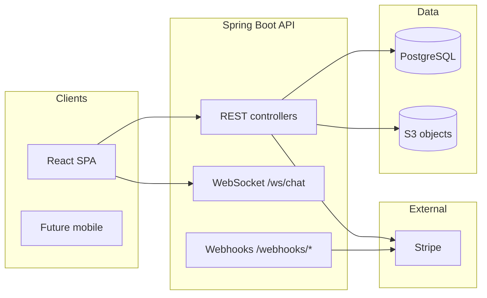

# Backend documentation (YouMe / dating-app)

Spring Boot API (Java), JWT bearer auth for most routes, PostgreSQL, optional S3 presigned uploads, Stripe subscriptions, WebSocket chat.

## Architecture (high level)

## Request conventions

- **Base URL:** application server root (configure per environment; see [../../docs/ENVIRONMENT_URLS.md](../../docs/ENVIRONMENT_URLS.md)). No global `/api` prefix in code unless you add a gateway.
- **Auth:** `Authorization: Bearer <JWT>` except public routes (`/auth/login`, `/auth/register`, registration email/phone flows, `GET /auth/registration/tokyo-wards`, `GET /subscription/plans`, `GET /ai/capabilities`, `GET /ai/plans`, webhooks).
- **Content-Type:** `application/json` unless noted (`multipart/form-data` for register/complete).

## Document index

| File | Topics |
|------|--------|
| [auth-api.md](./auth-api.md) | Login, multipart register, onboarding registration |
| [user-api.md](./user-api.md) | `/me` profile, locale, password, delete, discovery settings, AI profile tips, demo upgrade |
| [likes-api.md](./likes-api.md) | Likes, inbound (gated), superlikes, passes/dislikes |
| [feed-blocks-photos-ai-api.md](./feed-blocks-photos-ai-api.md) | Discover feed, blocks, photos/presign, AI capability matrix, chat assistant |
| [messages-api.md](./messages-api.md) | Matches list, unread, read state, messages, match delete |
| [subscription-api.md](./subscription-api.md) | Plans, checkout, confirm, cancel, downgrade, mobile verify stubs |
| [webhook-api.md](./webhook-api.md) | Stripe/Apple/Google webhook endpoints |

## Other artifacts

- [api-postman-collection.json](./api-postman-collection.json) — Postman Collection v2.1
- [aws-rds-migration.sql](./aws-rds-migration.sql) — Consolidated PostgreSQL schema for empty RDS

## Configuration pointers

- Local example: `application-local.example.yml`
- Flyway migrations (source of truth for incremental changes): `src/main/resources/db/migration/`
