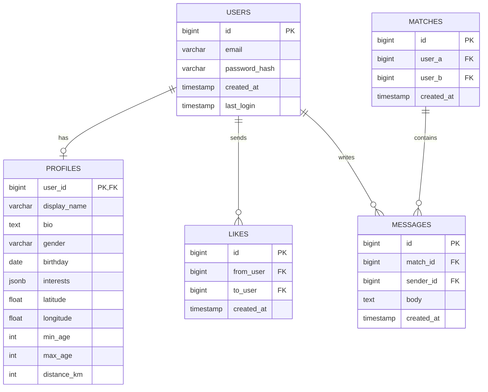

```mermaid
erDiagram
  USERS ||--o| PROFILES : has
  USERS ||--o{ LIKES : sends
  USERS ||--o{ MESSAGES : writes
  MATCHES ||--o{ MESSAGES : contains
  USERS {
    bigint id PK
    varchar email
    varchar password_hash
    timestamp created_at
    timestamp last_login
  }
  PROFILES {
    bigint user_id PK, FK
    varchar display_name
    text bio
    varchar gender
    date birthday
    jsonb interests
    float latitude
    float longitude
    int min_age
    int max_age
    int distance_km
  }
  LIKES {
    bigint id PK
    bigint from_user FK
    bigint to_user FK
    timestamp created_at
  }
  MATCHES {
    bigint id PK
    bigint user_a FK
    bigint user_b FK
    timestamp created_at
  }
  MESSAGES {
    bigint id PK
    bigint match_id FK
    bigint sender_id FK
    text body
    timestamp created_at
  }
```
